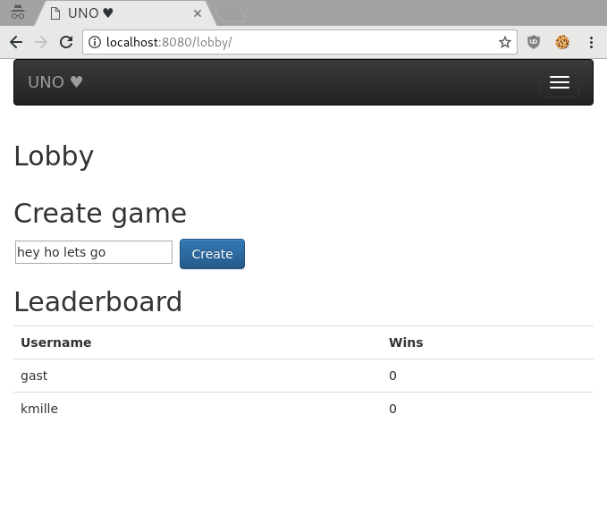
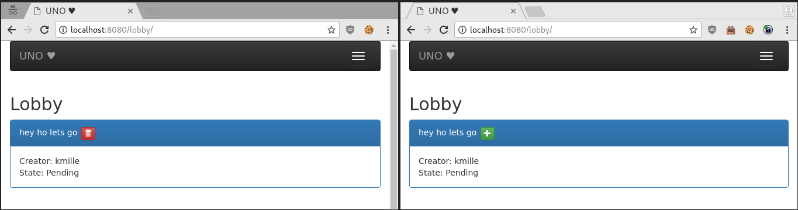
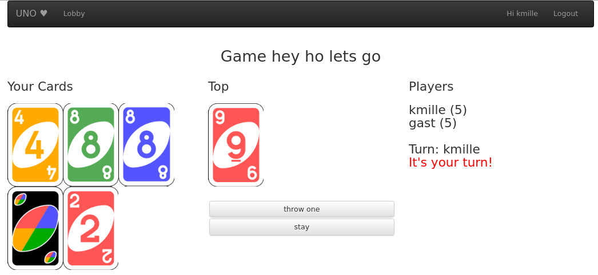

# UNO <3 (the worlds only flash-free uno)

This was a hobby project to get experience with django + channels (websockets) 
The code of the game itself is still pretty ugly  

# Installation 
You can use the Vagrant file in the deployment dir  
vagrant up  
sudo -s  
apt install python3 python3-pip python3-virtualenv redis-server nginx  
systemctl start redis-server  
systemctl enable redis-server  
pip3 install virtualenv  
cd /opt/  
git clone https://github.com/busbauen/uno.git  
cd uno/  
python3 -m virtualenv venv  
source venv/bin/activate  
pip install -r requirements.txt  
python manage.py migrate   

## Running for testing  
for testing (run both and in virtualenv):  
python manage.py runserver 0.0.0.0:80  
or  
daphne -b 0.0.0.0 -p 80 game.asgi:channel_layer  
python manage.py runworker  

## For productive deployment:  
Change debug = False and the SECRET_KEY in game/settings.py
mv deployment/uno-daphne.service /etc/systemd/system  
mv deployment/uno-worker.service /etc/systemd/system  
systemctl daemon-reload  
mv deployment/nginx-uno.conf /etc/nginx/conf.d/  
rm /etc/nginx/sites-enabled/default  
systemctl enable nginx  
systemctl start nginx  
systemctl enable uno-daphne.service  
systemctl start uno-daphne.service  
systemctl enable uno-worker.service  
systemctl start uno-worker.service  
chown www-data:www-data /opt/uno/db.sqlite3  
chown www-data:www-data /opt/uno  #sqlite needs to write in this directory  

# Setup Github oauth
Please use the official docs from http://django-allauth.readthedocs.io/en/latest/installation.html  

# Description of the game states
- state 1: player has to throw
- state 2: player can trow or next
- state 3: waiting for the client telling the backend the wished color
- state 4: has to trow 2 ore more cards

# References
http://masnun.rocks/2016/09/25/introduction-to-django-channels/  
http://masnun.rocks/2016/11/02/deploying-django-channels-using-daphne/  
https://channels.readthedocs.io/en/latest/deploying.html  
https://simpleisbetterthancomplex.com/tutorial/2016/06/27/how-to-use-djangos-built-in-login-system.html  
https://simpleisbetterthancomplex.com/tutorial/2017/02/18/how-to-create-user-sign-up-view.html  
https://simpleisbetterthancomplex.com/tutorial/2016/07/22/how-to-extend-django-user-model.html  

# Some screenhots
  
  
  
